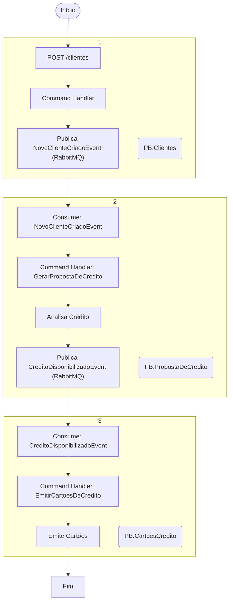

# Introdução

Este repositório faz parte do desafio técnico para vaga de Desenvolvedor Backend no PB. O objetivo é demonstrar habilidades técnicas em .NET 8, mensageria, arquitetura de microsserviços, resiliência e testes automatizados, conforme proposto no desafio:

**Desafio:**
- Cadastrar clientes via API e comunicar por mensageria;
- Geração de proposta de crédito;
- Emissão de até 2 cartões de crédito.

**Microsserviços envolvidos:**
- Cadastro de clientes
- Proposta de crédito
- Cartão de crédito

**Requisitos:**
- Microsserviços em .NET 8.0
- Hub de mensageria utilizando RabbitMQ, Azure Service Bus e/ou Azure EventHub (neste projeto, RabbitMQ)
- Fluxograma da solução (exemplo: https://draw.io/)
- Testes de unidade com xUnit

**Regras de score da proposta de crédito:**
- 0 a 100: Não é permitido liberação de cartão de crédito
- 101 a 500: Permitido liberação de cartão de crédito (limite R$ 1.000,00)
- 501 a 1000: Permitido liberação de até 2 cartões de crédito (limite R$ 5.000,00 cada)

**O que será avaliado:**
- Conhecimento em mensageria, RESTful, testes de unidade
- Código limpo, organizado e de fácil manutenção
- Resolução de problemas lógicos
- Mensagens e mudanças nos commits
- Documentação clara sobre construção, decisões e execução do app

---
# PB.Microservices – Visão Geral e Comunicação

Este documento apresenta um resumo da arquitetura e do fluxo de comunicação entre os quatro principais microsserviços do ecossistema PB:

- [PB.Clientes](https://github.com/GabrielolCarmo/PB.Clientes)
- [PB.PropostaDeCredito](https://github.com/GabrielolCarmo/PB.PropostaDeCredito)
- [PB.CartoesCredito](https://github.com/GabrielolCarmo/PB.CartoesCredito)
- [PB.Commons](https://github.com/GabrielolCarmo/PB.Commons)

Entre nos repositórios para verificar os detalhes de implementação.

---

## Objetivo

Demonstrar como os serviços se integram utilizando mensageria assíncrona via RabbitMQ, detalhando o fluxo de criação de cliente, análise de crédito e emissão de cartões, além de orientar o desenvolvedor sobre o uso do RabbitMQ no ecossistema.

---

## Arquitetura Geral

Os projetos seguem uma arquitetura em camadas (API, Application, Domain, Infra) baseada em DDD e CQRS, com comunicação entre microsserviços feita via eventos e comandos publicados em filas RabbitMQ, utilizando MassTransit como abstração.

### Componentes

- **PB.Clientes**: Responsável pelo cadastro de clientes e início do fluxo.
- **PB.PropostaDeCredito**: Realiza análise de crédito e define o limite disponível.
- **PB.CartoesCredito**: Emite cartões de crédito conforme o crédito aprovado.
- **PB.Commons**: Biblioteca compartilhada de contratos, eventos e utilitários.

---

## Diagrama de Fluxo de Comunicação

### Descrição do Fluxo

1. **Cadastro de Cliente**  
   - O usuário faz uma requisição HTTP para a API do [PB.Clientes](https://github.com/GabrielolCarmo/PB.Clientes).
   - O serviço valida e persiste o cliente, publicando o evento `NovoClienteCriadoEvent` na fila RabbitMQ.

2. **Análise de Proposta de Crédito**  
   - O [PB.PropostaDeCredito](https://github.com/GabrielolCarmo/PB.PropostaDeCredito) consome o evento, processa a análise de crédito e publica o evento `CreditoDisponibilizadoEvent` em outra fila.

3. **Emissão de Cartões**  
   - O [PB.CartoesCredito](https://github.com/GabrielolCarmo/PB.CartoesCredito) consome o evento de crédito aprovado e emite os cartões de acordo com as regras de negócio.

4. **PB.Commons**  
   - Define contratos de mensagens, eventos e utilitários compartilhados entre os serviços.

---

## Mensageria e RabbitMQ

### Como o RabbitMQ é Utilizado

- **MassTransit** é utilizado como biblioteca de integração para facilitar a publicação e o consumo de mensagens RabbitMQ.
- Cada serviço define seus próprios consumers e producers, configurando endpoints e filas específicas, você pode verificar os detalhes de implementação, com as regras de resiliência nos repositórios respectivos.
- Eventos de domínio são propagados entre os serviços via mensagens, desacoplando os microsserviços e permitindo escalabilidade e resiliência.

### Como Utilizar o RabbitMQ no Ecossistema

- **Configuração**: Defina as variáveis de ambiente ou appsettings para host, usuário, senha e nomes das filas.
- **Execução**: Certifique-se de que o RabbitMQ está rodando localmente ou em ambiente acessível.
- **Criação de Filas**: O MassTransit cria automaticamente as filas ao enviar ou consumir mensagens.
- **Resiliência**: Os projetos implementam retries imediatos e redelivery escalonado para garantir a entrega das mensagens.

---

## Referências dos Repositórios

- [PB.Clientes](https://github.com/GabrielolCarmo/PB.Clientes)
- [PB.PropostaDeCredito](https://github.com/GabrielolCarmo/PB.PropostaDeCredito)
- [PB.CartoesCredito](https://github.com/GabrielolCarmo/PB.CartoesCredito)
- [PB.Commons](https://github.com/GabrielolCarmo/PB.Commons)

---

## Observações

- Todos os projetos possuem testes unitários utilizando xUnit e FluentAssertions.
- O padrão de eventos e contratos compartilhados está centralizado no [PB.Commons](https://github.com/GabrielolCarmo/PB.Commons).
- Para executar o ecossistema, siga as instruções de build e execução em cada repositório.

---
